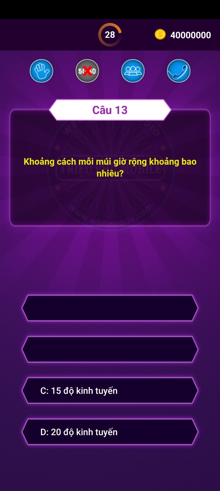

# Question Answering Game Application for Android

_AiLaTrieuPhu is a game that simulates the famous game show of a Vietnamese television station, with vivid sound that will give players the thrill of sitting on a hot chair at the studio._

## Description

AiLaTrieuPhu is a game that simulates the famous game show of a Vietnamese television station, with vivid sound that will give players the thrill of sitting on a hot chair at the studio.

Players will in turn answer 15 questions from easy to difficult by multiple choice: choose the correct answer out of 4 given answers.

In order to pass 15 questions, the Player has 3 help, which is to eliminate two wrong options, call to consult experts, and consult the audience.

## Screenshoot

## Requirement

Android SDK >= 22 (Android 5.1)

## Authors

[@hieubui00.it](https://github.com/hieubui00)

## Version History

- 1.0.0
  - Initial Release
